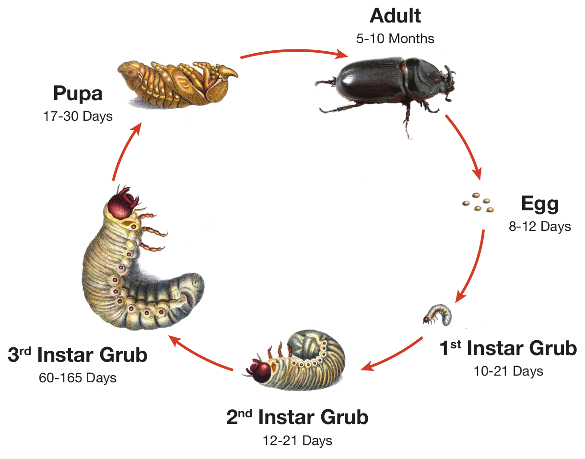
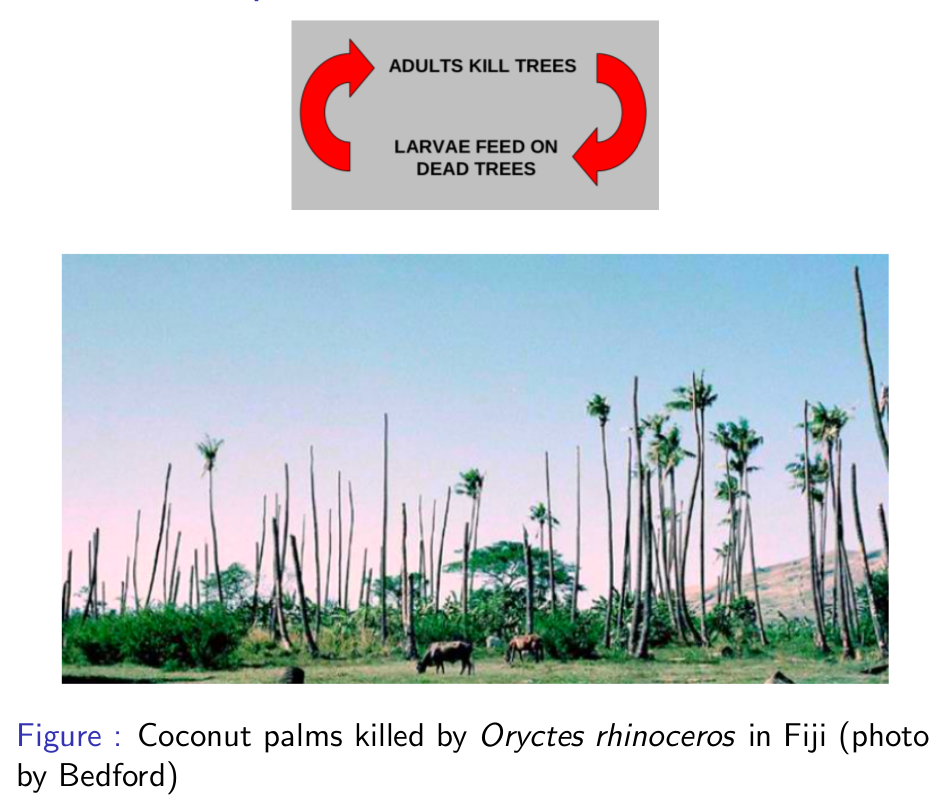
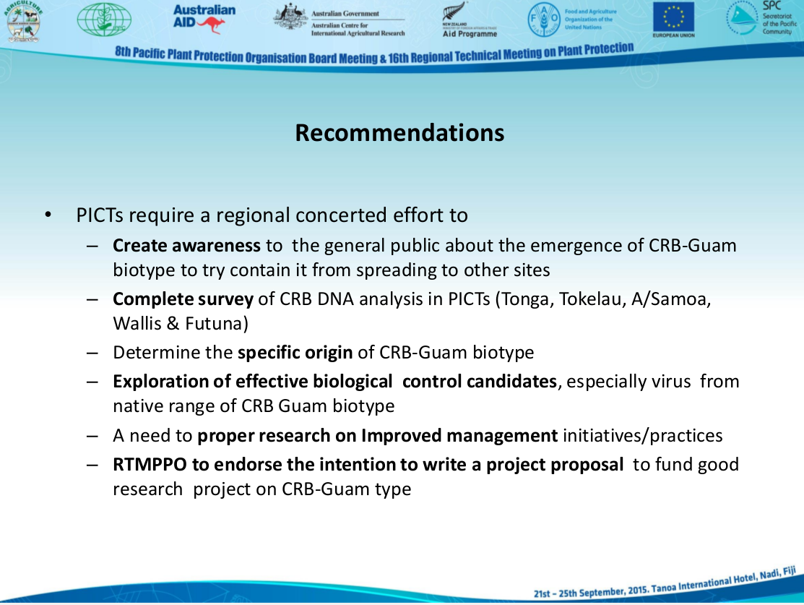

% Update on the Guam Coconut Rhinoceros Beetle Situation for the Guam Invasive Species Council
% Aubrey Moore
% November 20, 2015 (Revised March 2, 2016)

## Basic Biology

- Grubs feed on decaying vegetation and do no damage.
- Adults damage and sometimes kill palms when they bore into crowns to feed on sap.

## Positive Feedback Cycle

- A population explosion can occur when large numbers of adults kill palms which become breeding sites which generate even larger numbers of adults.

## CRB on Guam

- First detected in Tumon, September, 2007
- Eradication attempt based on mass trapping and sanitation failed
- CRB spread island-wide by 2010
- Attempts at biological control using Oryctes nudivirus (OrNV) failed

## Oryctes Nudivirus

- a naturally occurring virus which attacks only rhino beetles
- discovered in Malaysia during the 1960's
- quickly became the preferred biological control agent for managing CRB on Pacific islands
- prevents population explosions
- is persistent once introduced into a CRB population

## Oryctes Nudivirus

- OrNV reduced damage by up to 90% when introduced into Pacific island CRB populations and population suppression was persistent.

## CRB Attacking Guam is a Novel Biotype (CRB-Guam)

- genetically different
- resistant to all available isolates of OrNV
- more invasive

## CRB-Guam is Genetically Different

## CRB-Guam is More Invasive

- Following 30 years without range expansion, CRB has recently invaded Guam, Oahu (Hawaii), Guadalcanal (Solomon Islands), and Port Morseby (PNG). All new invasions involve CRB-Guam.

## Discovery of the CRB-Guam Biotype

* Marshall, Sean, Maclean Vaqalo, Aubrey Moore, Roland Quitugua, and Trevor Jackson (2015). **A new invasive biotype of the coconut rhinoceros beetle (Oryctes rhinoceros) has escaped from biological control by Oryctes rhinoceros nudivirus.** Presented at the International Congress on Invertebrate Pathology and Microbial Control and the 48th Annual Meeting of the Society for Invertebrate Pathology, Vancouver, BC, August 2015. Available on-line at <http://www.sipmeeting.org/van1/SIP2015-Full%20Program.pdf>

## Discovery of the CRB-Guam Biotype

* Jackson, Trevor (2015). **Need for emergency response for a new variant of rhinoceros beetle (Guam biotype).** International Association for the Plant Protection Sciences Newsletter (XI). November, 2015. Available on-line at <https://www.plantprotection.org/portals/0/documents/newsletters/2015/iapps%2011-2015.pdf>

## Discovery of the CRB-Guam Biotype

*  Vaqalo, Maclean, Sean Marshall, Trevor Jackson, Aubrey Moore (2015). **An Emerging Biotype of the Coconut Rhinoceros Beetle Discovered in the Pacific.** Secretariat of the Pacific Community, Land Resources Division. Available on-line at <http://www.spc.int/lrd/plant-health-publications/doc_download/2374-ph-agalertno51>

## Recommended Action

## Recent Changes on Guam

## Recent Changes on Guam

- A CRB population explosion triggered by Typhoon Dolphin was predicted in the
following press release.
- Anonymous. **Pacific Island Entomologists are Worried About a New
Type of Coconut Rhinoceros Beetle Discovered on Guam.** University of Guam,
College of Natural and Applied Sciences Press Release, September 2, 2015.
<http://guaminsects.net/anr/sites/default/files/CRBpressRelease.pdf>

## Recent Changes on Guam

- Recent trapping data indicate that a CRB population explosion was initiated
by Typhoon Dolphin which visited Guam in May 2015, leaving many new breeding sites in its wake.
